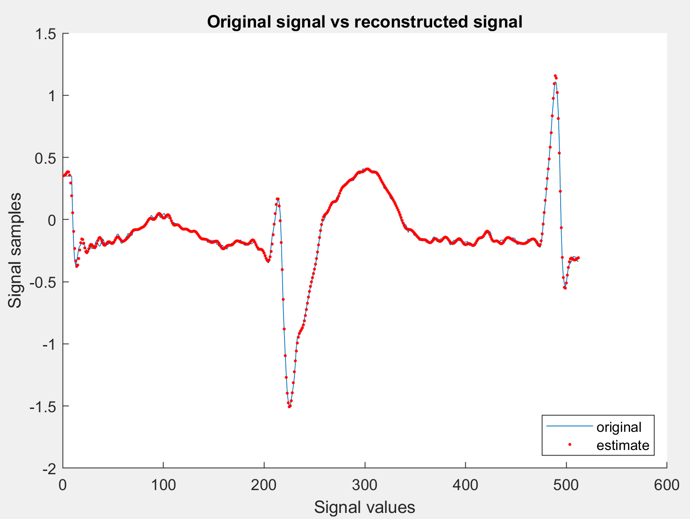
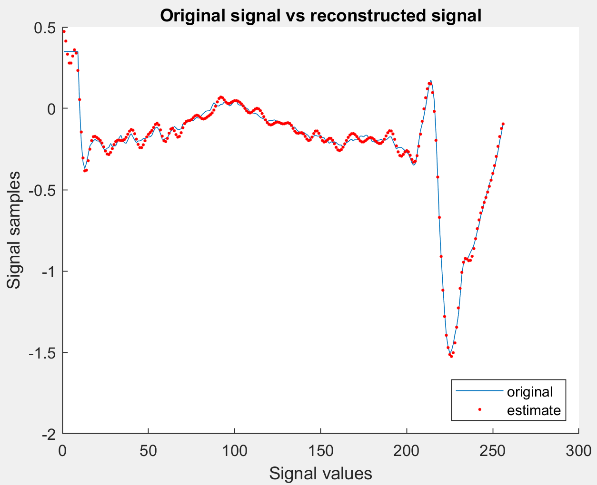

Link to github: https://github.com/JonathanFL/wsn_assignment_2

# WSN Assignment 2 - Discrete Cosine Transformation in TelosB Mote/Cooja#

DCT-II transform of a length N signal x is given as,

Tasks completed are:
- [x] Implemented and measured the execution time and energy consumption for the following cases:
     - [x] N = 256 and M = 75.
     - [x] N = 512 and M = 120.
- [x] Measure the mean square error between the original signal and reconstructed signal for both the cases.
Here N is the signal length and M is the number of selected DCT coefficients.

For calculating the energy consumption, the datasheet for the TelosB mote is used:

https://www.willow.co.uk/TelosB_Datasheet.pdf

It states that the current it draws from being in active mode (not sleeping) is 21 µA. Then the total energy consumption must be:

computing time __*__ 21 µA

## Results

### N = 512, M = 120

Execution time: 20 minutes

Energy consumption: 1200 * 21 µA = 25.200 mA

mse = 0.1190

- - - -

### N = 256, M = 75

Execution time: 3 minutes

Energy consumption: 180 * 21 µA = 3.780 mA

mse = 0.1554

